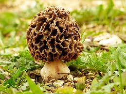
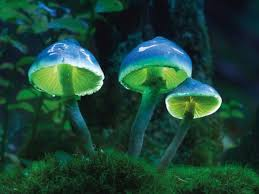
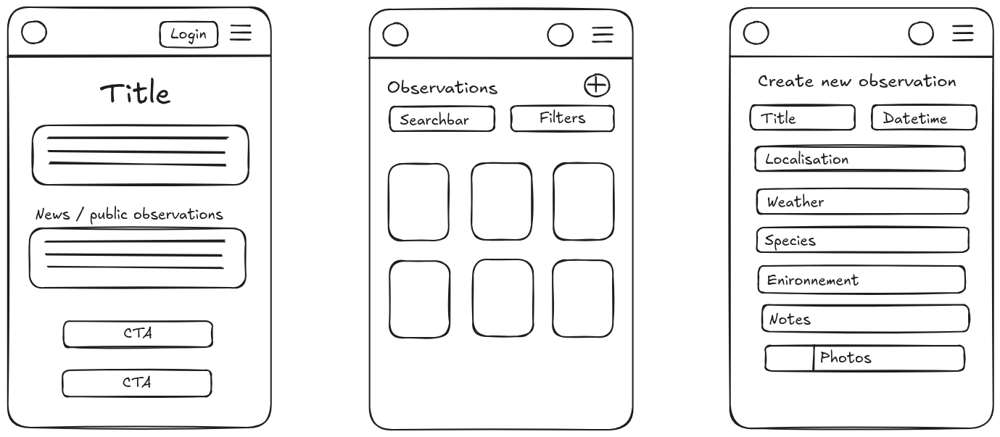

---

marp: true
theme: gaia
_class: invert

---

# MycoNote

 

---

## Présentation du service

### **MycoNote**

Le carnet de terrain numérique pour explorateurs mycologiques.

---

## Charte graphique

### Palette de couleurs

 

  

---

## Problème

Outil **centralisé** permettant de **documenter**, **organiser** et **retrouver** les découvertes de champignon sur le terrain.

---

## Besoins du projet

* Retenir où, quand et dans quelles **conditions** un champignon a été trouvé.
* Pouvoir **rechercher** une observation passée rapidement.
* **Identifier** plus facilement une espèce rencontrée.
* **Conserver** les données sans devoir jongler entre photos, notes, Google Maps et carnets papier.
* Utiliser un outil même **hors connexion**.

---

## Public cible

* **Mycologues**.
* **Randonneurs**.
* **Étudiants** en biologie ou écologie.
* **Guides** nature, animateurs.
* **Associations** naturalistes.

---

## Fonctionnalité principale

### Carnet numérique d'**observation** :
* Création rapide de **fiches** d'observations.
* **Photos**, dates, habitat, notes, **localisation**, météo, espèce si connue.
* **Consulter**, **rechercher**, **trier** les anciennes observations.
* Utilisable **hors ligne**  (PWA).
* Possibilité de rendre **public** une observation.

---

## Fonctionnalités secondaires

1. **Fiches** descriptives de champignon avec système de recherche.
2. Suggestions d'**identification** assistée.
3. **Export** des données (pdf).
4. **Alerte** saisonnières.
5. **Partage** entre utilisateur.
6. Enregistreur **audio**.

---

## Zoning
 

---

## Concurrence

* **iNaturalist** : carnet de note naturaliste **généraliste**.
* **Champignouf** et autres : très axé sur la reconnaissance.

---

## Stack technique

* Frontend: **React** avec typescript.
* Backend: API **Node.js** avec Express et typescript.
* Base de données: **PostgreSQL**.

  

